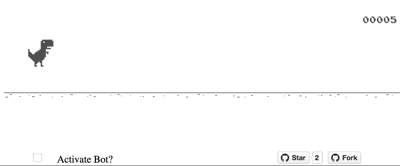

# AI Dino Runner 🚀

A modified version of the classic Chrome T-Rex Runner game with AI auto-play and fun mode features.

## Features

### Dynamic Character Switching
- **Automatic character changes** every 7-10 seconds during gameplay
- **5 different characters**: Dino 🦖, Bear 🐻, Tiger 🐯, Cat 🐱, Lion 🦁
- Each character has unique visual effects (size, color tint)
- **Visual indicator** in top-right corner shows current character
- Characters switch randomly without interrupting gameplay for smooth gameplay

### Fun Mode
- Press 'F' to toggle Fun Mode
- **On-screen Messages**: Random encouraging messages appear on screen every 2 seconds
- Background color changes randomly every second
- Game speed gradually increases over time

### Controls
- **Space/Up Arrow**: Manual jump
- **Down Arrow**: Duck
- **S**: Toggle AI auto-play
- **F**: Toggle Fun Mode
- **Enter**: Restart after game over

### UI Enhancements
- Custom title: "AI Dino Runner 🚀"
- **On-screen fun messages** appear during Fun Mode
- **AI status indicator** (🤖 AI ON) in top-left when enabled
- **Character indicator** in top-right showing current animal
- Score logged to console for debugging
- Clean, modular JavaScript code

## How to Play

1. Open `index.html` in a web browser
2. Press Space to start the game
3. Use 'S' to enable AI auto-play
4. Use 'F' to enable Fun Mode for extra excitement
5. Try to achieve the highest score!

## Technical Details

- Built on the original Chrome T-Rex Runner codebase
- Uses `requestAnimationFrame` for smooth animation
- Modular code with clear separation of concerns
- Compatible with existing Runner.instance_ structure

## Original Source

This is a modified version of the T-Rex Runner game extracted from the Chrome offline error page.
Original source: [Chromium source](https://cs.chromium.org/chromium/src/components/neterror/resources/offline.js?q=t-rex+package:%5Echromium$&dr=C&l=7)

[Play the original!](http://wayou.github.io/t-rex-runner/)

- [d-nery](https://github.com/d-nery/)/[t-rex-runner](https://github.com/d-nery/t-rex-runner) [Novas coisas](http://d-nery.github.io/t-rex-runner/) 
 

- [chirag64](https://github.com/chirag64)/[t-rex-runner-bot](https://github.com/chirag64/t-rex-runner-bot) [t-rex runner bot](https://chirag64.github.io/t-rex-runner-bot/) 
 

- [19janil](https://github.com/19janil)/[t-rex-runner](https://github.com/19janil/t-rex-runner) [t-rex runner](https://19janil.github.io/t-rex-runner/) 
 

- [enthus1ast](https://github.com/enthus1ast)/[chromeTrip](https://github.com/enthus1ast/chromeTrip) [Chrome Trip by code0](https://code0.itch.io/chrome-trip) 
 

- [zouariste](https://github.com/zouariste)/[corona-runner](https://github.com/zouariste/corona-runner) [Corona runner](https://zouariste.github.io/corona-runner/) 
 

